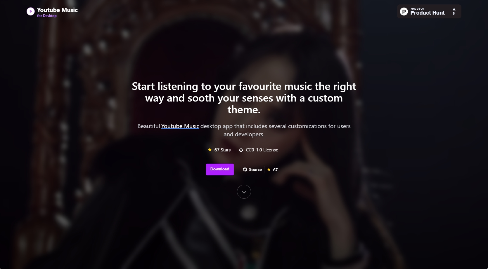
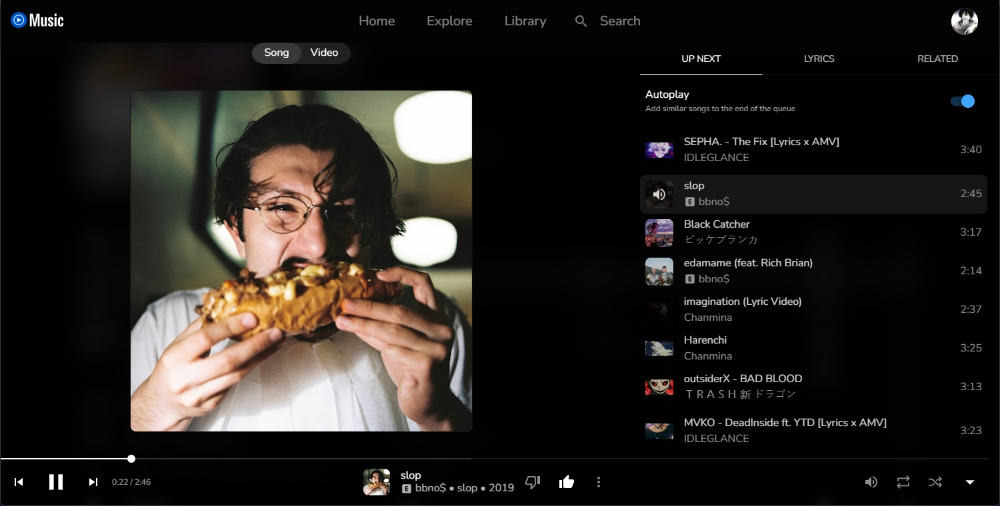

<p align="center">
  
</p>

<h2 align="center">
    Youtube Music for Desktop (ytmdesktop2)
</h2>

<p align="center">
Beautiful Youtube Music desktop app that includes several customizations for users and developers.
</p>

[](https://discord.gg/dq4bZMhMjT)
[](https://github.com/Venipa/ytmdesktop2/releases/latest)


<p align="center">
  
</p>

## Features

### Mini Player (Beta)


### Discord Rich Presence


### Custom CSS


### OBS Implementation

[OBS Browser Source Files](https://obsproject.com/forum/threads/zyphens-now-playing-overlay.125383/post-557409),
don't forget to enable the api inside the ytmdesktop2 app

---------------

... features to be added ...
&nbsp;&nbsp;

---------------
&nbsp;&nbsp;
## Project setup
```
yarn
```

### Compiles and hot-reloads for development
```
yarn dev
```

### Compiles and minifies for production
```
yarn build
```
### Customize configuration
See [Configuration Reference](https://cli.vuejs.org/config/).
