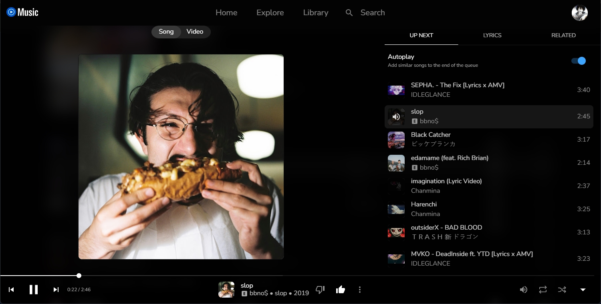

> [!NOTE]
> <b>We hit 1000 Stars, thanks for your continued support ♥️</b>
>
> I've never imagined that a personal project for my one use would become that large :)
>
> <b>Additionally v1.0 has been released</b>, completed rewritten services and updated UI.
> stay tuned for new planned features ♥️

<h2 align="center">
    Youtube Music for Desktop (ytmdesktop2)
</h2>


<p align="center">
Beautiful Youtube Music desktop app that includes several customizations for users and developers.
</p>

[](https://discord.gg/dq4bZMhMjT)
[](https://github.com/Venipa/ytmdesktop2/releases/latest)


<p align="center">
  
</p>

## Features

### Last.FM (Scrobble)


### Tray View

Quick now-playing popup from the system tray with transport controls.

### Discord Rich Presence


### Themes


### OBS Implementation

[OBS Browser Source Files](https://github.com/Venipa/ytmdesktop2/releases/download/v0.12.11/Zyphen.s.Now.Playing.zip)
/
[OBS Plugin Thread](https://obsproject.com/forum/threads/zyphens-now-playing-overlay.125383/post-557409),
don't forget to enable the api inside the ytmdesktop2 app

also make sure to set a custom the port (`append ?port=<custom port> to source file protocol`) if changed in the app (default is 13091)

### Stream Deck

Control playback from an Elgato Stream Deck via the local API.

1. Settings → **API & Integrations** → **API** → enable API
2. Settings → **Authentication** → Require authorization
3. Download the `.streamDeckPlugin` from [Releases → Stream Deck Plugin](https://github.com/Venipa/ytmdesktop2/releases/tag/streamdeck-plugin) (or from the docs site / app Settings) and double-click / import it in the Stream Deck software
4. In Stream Deck, add a YTMDesktop2 action → **Authorize** → approve under Authentication

---

... features to be added ...
&nbsp;&nbsp;

---

&nbsp;&nbsp;

## Project setup

Monorepo (pnpm workspace). Electron app lives in [`apps/ytmdesktop2`](./apps/ytmdesktop2); Stream Deck plugin in [`packages/streamdeck`](./packages/streamdeck).

```bash
# gh is required for fetching github packages (Venipa/xosms)
gh auth refresh -s read:packages
pnpm install
pnpm dev
```
## Contributors
<a href="https://github.com/Venipa/ytmdesktop2/graphs/contributors">
  
</a>


<div align="center">
 <picture>
   <source media="(prefers-color-scheme: dark)" srcset="https://api.star-history.com/svg?repos=venipa/ytmdesktop2&type=Date&theme=dark" />
   <source media="(prefers-color-scheme: light)" srcset="https://api.star-history.com/svg?repos=venipa/ytmdesktop2&type=Date" />
   
 </picture>
</div>
