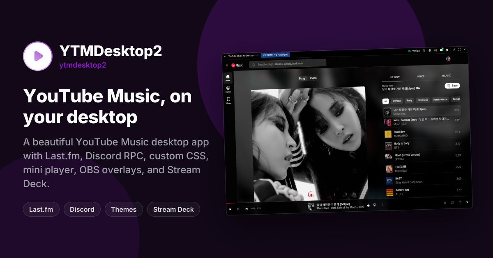
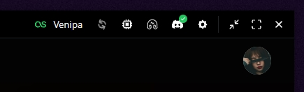
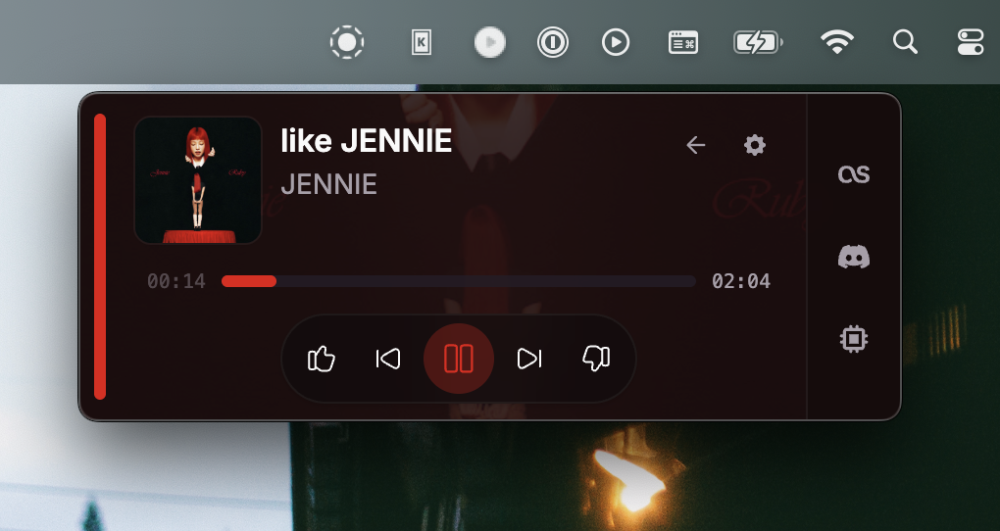
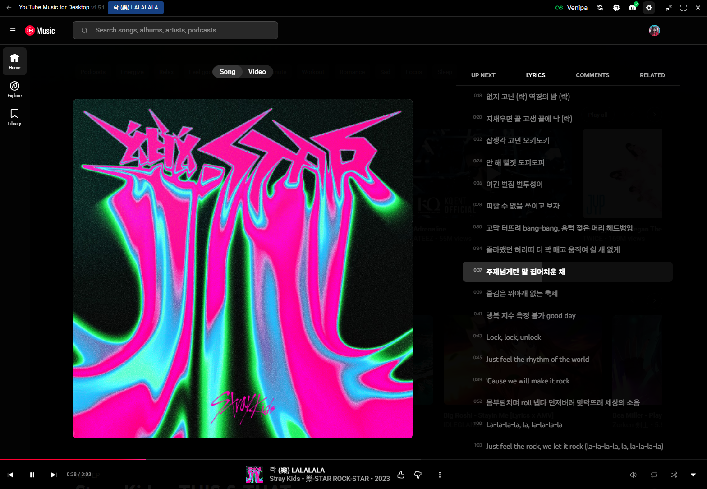
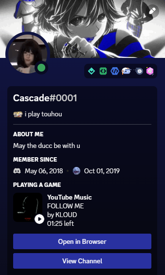
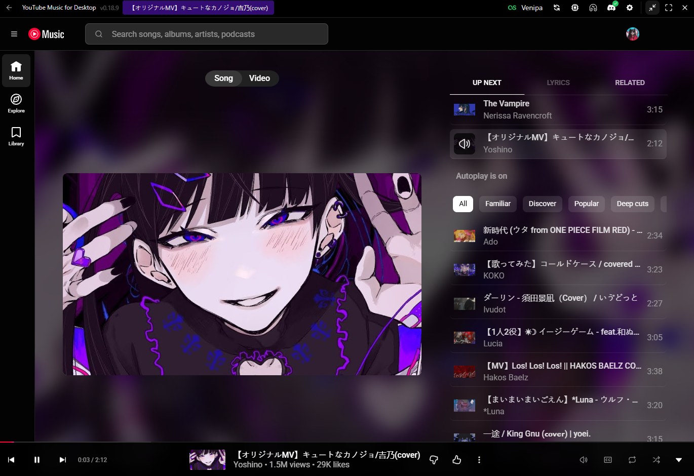
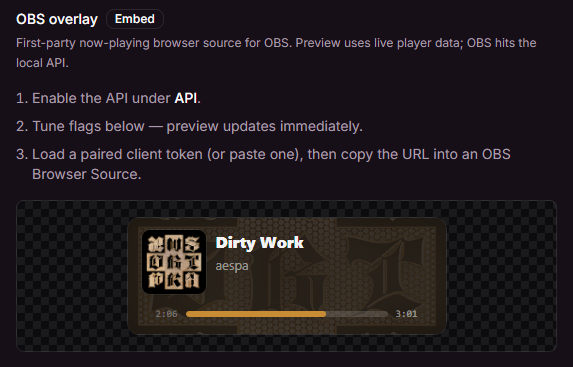

> [!NOTE]
> <b>We hit 1000 Stars, thanks for your continued support ♥️</b>
>
> I've never imagined that a personal project for my one use would become that large :)
>
> <b>Additionally v1.0 has been released</b>, completed rewritten services and updated UI.
> stay tuned for new planned features ♥️

<h2 align="center">
    Youtube Music for Desktop (ytmdesktop2)
</h2>

<p align="center">
Beautiful Youtube Music desktop app with customizations for users and developers.
</p>

<p align="center">
  
</p>

<p align="center">
  <a href="https://discord.gg/dq4bZMhMjT"></a>
  <a href="https://github.com/Venipa/ytmdesktop2/releases/latest"></a>
  
</p>

## Features

### Last.fm

Scrobble and update Now Playing while you listen.



### Tray view

Compact now-playing popup from the system tray.



### Lyrics

Timed lyrics in the player (Better Lyrics, Unison, LRCLIB).



### Discord Rich Presence

Show the current track in Discord.



### Themes

Bundled or custom SCSS/CSS for the YouTube Music UI.



### OBS overlays

First-party now-playing browser sources. Enable API, open **Settings -> OBS**, copy URL into an OBS Browser Source (default port `13091`).



```text
http://127.0.0.1:13091/embed/now-playing
```

### Shared links (`ytmd://`)

Open tracks, playlists, and channels in the app (`ytmd://` or swap `https://` on music.youtube.com URLs).

### Stream Deck

1. Enable API + require authorization
2. Install the [Stream Deck plugin](https://github.com/Venipa/ytmdesktop2/releases/tag/streamdeck-plugin)
3. Authorize from a YTMDesktop2 action

More detail in [`apps/docs/content/docs/features`](./apps/docs/content/docs/features).

## Project setup

Monorepo (pnpm). App: [`apps/ytmdesktop2`](./apps/ytmdesktop2). Stream Deck: [`packages/streamdeck`](./packages/streamdeck).

```bash
# gh required for github packages (Venipa/xosms)
gh auth refresh -s read:packages
pnpm install
pnpm dev
```

## Inspiration

ytmdesktop and th-ch / Pear Desktop inspired a lot of my own work on this project: ideas, approaches, and the wider desktop YouTube Music space. Also Last.fm, Better Lyrics, and LRCLIB. Grateful they exist.

## Contributors

<a href="https://github.com/Venipa/ytmdesktop2/graphs/contributors">
  
</a>

<p align="center">
  <picture>
    <source media="(prefers-color-scheme: dark)" srcset="https://api.star-history.com/svg?repos=venipa/ytmdesktop2&type=Date&theme=dark" />
    <source media="(prefers-color-scheme: light)" srcset="https://api.star-history.com/svg?repos=venipa/ytmdesktop2&type=Date" />
    
  </picture>
</p>
